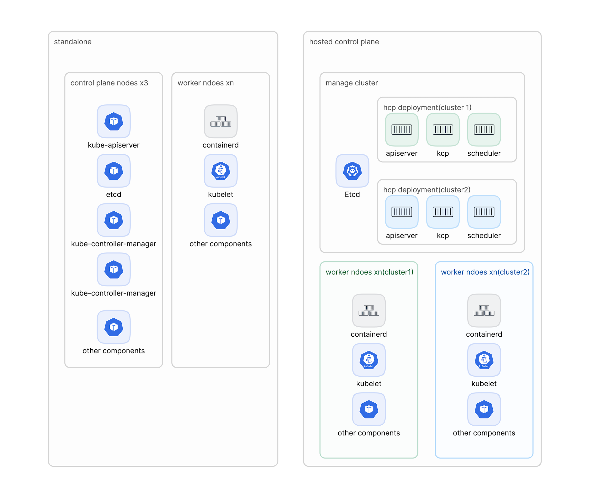

# Architecture

Alauda Control Plane is often deployed in standalone model, where a cluster consists of a control plane and a data plane, The control plane is responsible for managing the cluster, including the cluster's resources, applications, and services. The data plane is responsible for the cluster's data, including the cluster's storage, network, and compute resources.

The control plane is deployed as a set of Kubernetes control plane components, including:

- Kubernetes API server
- Kubernetes controller manager
- Kubernetes scheduler
- Kubernetes etcd

The data plane is deployed as a set of Kubernetes data plane components, including:

- Kubernetes node

The standalone control plane is hosted by a dedicated group of nodes, which can be physical or virtual machines.

Although the standalone model works well, some situations require an architecture where the control plane and data plane are decoupled. In those cases, the data plane is on a separate network domain with a dedicated physical hosting environment. The control plane is hosted by using high-level primitives such as deployments and stateful sets that are native to Kubernetes. The control plane is treated as any other workload.

# Benefits

The hosted control plane architecture offers several significant advantages over the traditional standalone model:

## Resource Efficiency

- **Shared Infrastructure**: Multiple control planes can share the same underlying infrastructure, reducing resource overhead
- **Optimized Resource Utilization**: Control plane components can be right-sized based on actual cluster needs rather than pre-allocated capacity
- **Reduced Hardware Requirements**: No need to dedicate nodes exclusively for control plane components

## Operational Simplicity

- **Centralized Management**: All control planes are managed from a single management cluster, simplifying operations
- **Simplified Upgrades**: Control planes can be upgraded independently without affecting workload clusters
- **Standardized Operations**: Treating control planes as workloads enables consistent operational practices using standard Kubernetes tools

## Scalability and Flexibility

- **Rapid Cluster Provisioning**: New clusters can be created quickly by deploying control plane workloads
- **Elastic Scaling**: Control plane components can scale independently based on demand
- **Multi-Tenancy**: Better isolation between different tenants' control planes while sharing infrastructure

## Cost Effectiveness

- **Lower Total Cost of Ownership**: Reduced infrastructure requirements lead to lower operational costs
- **Pay-as-you-Grow**: Resources can be allocated dynamically based on actual usage
- **Efficient Resource Pooling**: Shared resources across multiple control planes optimize overall utilization

## Enhanced Reliability

- **Failure Domain Isolation**: Data plane failures don't directly impact the control plane and vice versa
- **Independent Lifecycle Management**: Control plane and data plane can be maintained and upgraded independently
- **Better Disaster Recovery**: Control planes can be backed up and restored more easily as Kubernetes workloads

## Security and Isolation

- **Network Segmentation**: Control plane and data plane can operate in separate network domains
- **Reduced Attack Surface**: Data plane nodes don't need to host control plane components
- **Enhanced Multi-Tenancy**: Better isolation between different clusters' control planes

